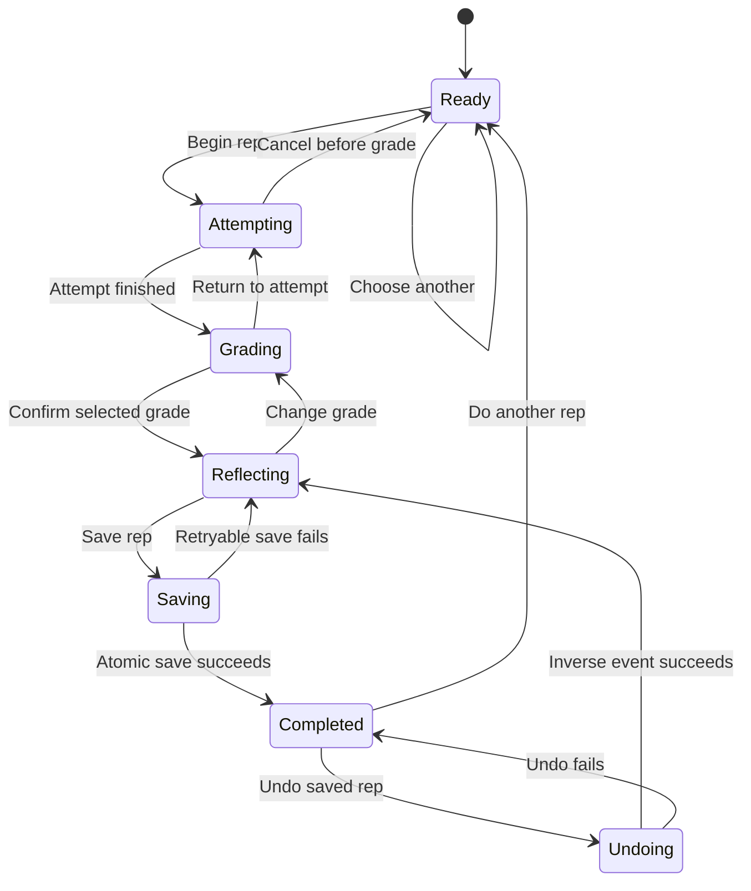

# Practice V2 Product and Implementation Specification

Status: implemented and running in the private beta behind `FEATURE_PRACTICE_V2`
Prototype: `/practice-v2-preview.html` in local or QA mode
QA product: Practice V2
Hosted production product: Practice V2 when `FEATURE_PRACTICE_V2=true`; V0 remains the fallback
Target state schema: v4
Current recommendation algorithm: `readiness-v1.9`

## 1. Product Decision

Practice V2 replaces the visible `one review + one new problem` decision with one adaptive
`Next rep`. The user should not need to decide whether today calls for a review, a new
problem, a transfer check, or an assessment. The recommendation engine makes that choice
from the user's evidence and goal.

The initial recommender is an explainable, deterministic rules engine. It is not a machine
learning model. Given the same normalized state, training profile, local date, and algorithm
version, it must return the same recommendation.

The purpose of the app is interview readiness, not maximizing stages, streaks, solved count,
or time spent in the tracker.

## 2. Product Principles

1. Show one useful action when the user arrives.
2. Preserve honest evidence; never convert historical exposure into mastery.
3. Separate exact-title retention from transferable skill evidence.
4. Do not leak a solution pattern before an independent attempt.
5. Ask for only the evidence that can improve a future recommendation.
6. Recalculate after every completed rep; do not create makeup debt.
7. Treat stopping after one honest rep as a valid stopping point.
8. Prefer explicit uncertainty over fake readiness precision.

## 3. Information Concealment Contract

The recommender may use topic, pattern, list source, previous notes, stored solutions, and
diagnostic reason codes internally. Assessment-like tasks must not expose those details
before the attempt.

| Information | Before attempt | After saved grade |
| --- | --- | --- |
| Problem title | Show | Show |
| LeetCode URL | Show | Show |
| Difficulty | Show | Show |
| Time box | Show | Show |
| Neutral recommendation reason | Show | Show |
| Topic or skill family | Hide | Reveal |
| Pattern name or expected technique | Hide | Reveal only if useful |
| Blind 75 / NeetCode source | Hide | Optional |
| Existing problem notes | Hide | Reveal on demand |
| Stored solution | Hide | Reveal on demand |
| Detailed recommendation score | Hide | Diagnostics only |

Allowed pre-attempt copy:

```text
Selected to measure current independent problem-solving evidence.
```

```text
Your plan needs a fresh independent result here.
```

Disallowed pre-attempt copy:

```text
Recommended because your hash-map transfer is unverified.
```

```text
Use this to test whether Two Sum generalizes to another set problem.
```

The concealment contract applies to the Practice card, recommendation notifications, page
title, accessible labels, tooltips, and any browser notification. Hidden text must not exist
in visually hidden DOM content before the attempt.

## 4. What V0 Retains

V0 remains the evidence ledger. Migration must preserve every existing value unless a
normalizer is already responsible for repairing an invalid value.

| V0 data or behavior | V2 treatment |
| --- | --- |
| Problem id, title, slug, URL | Preserve |
| Topic, topics, difficulty | Preserve; hide during assessment |
| Blind 75 / NeetCode membership | Preserve |
| Notes and optimal solution | Preserve; hide before attempt |
| Imported history | Preserve as exposure-only evidence |
| Red, yellow, and green history | Preserve as real attempt evidence |
| Manual backfills | Preserve with their original dates |
| Legacy `sessions` activity records | Preserve and continue recording internally |
| Stage, interval, next review | Preserve as exact-title retention evidence |
| Green streak and mastery | Preserve as V0 retention achievements |
| Complexity readiness | Preserve |
| Undo and history deletion | Preserve |
| CSV, JSON, and LeetCode imports | Preserve |
| Local JSON mode | Preserve |
| QA fixture/reset mode | Preserve |
| Hosted auth, SQLite, revisions, backups | Preserve |
| Library, Memory, Settings | Preserve |
| Theme preference | Preserve |

V2 must not recalculate historical stages during migration. New recommendations may
reinterpret the meaning of those stages, but the stored history and current values remain
available for audit and rollback.

## 5. V0 Concepts That Change Meaning

### Exact retention stages

The six existing stages continue to schedule the same title. They are no longer treated as
proof that the user can transfer the skill to a different problem.

`Transfer (Stage 3)` is a legacy label. Internally it means exact-title retention stage 3.
V2 scanning surfaces should not promote that number as interview-readiness evidence. Library
shows only whether an exact-title recall is scheduled or due, plus its date. The stored stage
remains available for scheduler compatibility and audit.

In V2, Library is an evidence browser and maintenance surface, not a second recommendation
queue. It preserves search, filters, exact-title retention stages, review dates, history,
editing, and LeetCode links. Previously seen problems without trusted grades display
`Assessment pending`; the adaptive Practice plan decides when that assessment is the best
next rep. The legacy `Practice now` cold-check action remains available only in the V0
fallback.

The V2 Library exposes only decision-useful categories:

- `Unseen`: no prior exposure or trusted attempt exists.
- `Assessment pending`: historical exposure exists, but current recall is unverified.
- `Needs repair`: the latest honest result was a miss.
- `Assisted`: the latest honest result used help or recorded substantial friction.
- `Independent`: the latest honest result was green without meaningful assistance.
- `Stale evidence`: a modifier/filter applied when the latest honest result is older than the
  configured evidence window. It can coexist with repair, assisted, or independent evidence.

Library search covers problem titles and topics in V2. Notes remain available in Details but
are excluded from the scanning surface. Exact-title schedule labels use plain states such as
`Scheduled`, `Due now`, and `Not scheduled`; active assessments hide topic and evidence until
the attempt is finished or canceled.

Problem Details leads with a read-only evidence summary: current problem evidence, last honest
check, latest result, assistance or friction, stopwatch time, and the exact-title recall date.
The editable form keeps topic, difficulty, notes, solution reference, complexity confidence,
and the exact-title date. Legacy status, completion count, green streak, mastery blockers, and
stage transitions remain stored for compatibility but do not lead the V2 interface.

### Cold checks

Cold-check evidence remains valuable, but `Cold check` is no longer the primary product
mode. It becomes one internal form of `Assessment` for previously seen, unverified work.

### New and review lanes

`Review` and `New` remain valid internal candidate attributes. They are removed as the two
permanent visible cards on Practice.

### Mastery

V0 mastery remains an exact-title retention achievement. Interview-readiness forecasts
must not equate mastered problem count with general problem-solving readiness.

## 6. Practice State Machine



Only a successful atomic Save writes evidence. Beginning a rep, opening LeetCode, choosing
a provisional grade, or editing reflection fields may update the separate resumable runtime
draft, but must not change problem history, stages, activity records, leaderboard totals,
or readiness aggregates.

## 7. Practice Screen States

### 7.1 Ready

Show:

- One problem title.
- Difficulty.
- Suggested time box.
- Evidence status in neutral language.
- A neutral `Why now` explanation.
- Primary `Begin rep` action.
- Secondary `Choose another` action.

Do not show topic, pattern, list source, notes, solution, expected complexity, previous
blockers, or a comparison to a known problem.

`Choose another` is a browser-runtime skip. It records no grade and changes no schedule. The
engine excludes the skipped candidate until the current runtime resets and
returns the next eligible candidate. When no suitable alternative exists, keep the original
recommendation and explain that it is the strongest available rep.

### 7.2 Attempting

Show:

- Problem title.
- Maximum time box.
- `Open on LeetCode`.
- Three instructions: start LeetCode's stopwatch, work independently, then return with the
  final time.
- `I finished the attempt`.
- A quiet cancel action.

The tracker does not run a competing timer in V2. Time comes from LeetCode's stopwatch and
is entered during reflection.

Canceling returns to Ready and retains the same recommendation. It does not create evidence.
Returning from Grading to Attempting also creates no evidence and preserves the active rep.

### 7.3 Grading

Use three evidence-oriented choices:

| Display label | Stored grade | Meaning |
| --- | --- | --- |
| Could not solve | `red` | Needed the core solution or did not reach working code |
| Solved with help or heavy friction | `yellow` | Needed meaningful help, major debugging, or struggled substantially |
| Solved independently | `green` | Working code and important tests completed without meaningful help |

A small syntax correction may still be green if it did not change the strategy and did not
require meaningful assistance. An API or syntax issue that prevented working code or required
outside help should be yellow or red according to the final level of independence.

Selecting a grade is provisional. A separate `Continue` action advances to Reflecting so an
accidental tap is harmless. `Back to attempt` returns to Attempting. Neither action saves.

### 7.4 Reflecting

Elapsed stopwatch minutes are requested for every grade. The user may explicitly choose
`I did not track it`; the app stores `null` instead of forcing fabricated timing data. Missing
time means the attempt can support independence or retention evidence but cannot support a
speed claim.

Reflection branches by grade:

| Grade | Required | Optional or implied |
| --- | --- | --- |
| Red | Time or `not tracked`, assistance classification, main blocker | Note |
| Yellow | Time or `not tracked`, assistance classification, main blocker, approach efficiency | Assistance may be `none` when friction or time alone caused yellow; note |
| Green | Time or `not tracked`, approach efficiency | Assistance is implicitly `none`; separate optional friction and note |

Red/yellow blockers are: getting started, strategy, not finding the optimal solution,
implementation, syntax/API, edge cases, complexity explanation, or time management. Green uses
a separate optional `friction` field: none, optimization/efficiency, minor implementation
friction, syntax/API recall, edge-case cleanup, complexity explanation, or time management. A green save normalizes `assistance: "none"` and
`blocker: null`; it never repurposes a failure blocker as a green value.

The locked time box is a target, not a grading gate. If tracked elapsed time exceeds it, the
attempt may still be green when the user reached working code without meaningful help. Reflection
shows the overrun and stores `timingStatus`, `minutesOverTarget`, and `timeBoxRatio` as separate
speed evidence. This preserves an honest stopwatch value while allowing the plan to target speed
later. Untracked green may establish independence, but never speed or timed-performance evidence.

Complexity evidence is separate from the grade:

- `Not checked`: the user did not verify the explanation.
- `Partial`: the user understood it but could not fully explain or derive it.
- `Explained`: the user confidently explained time and space complexity.

Only `Explained` satisfies the legacy `complexityKnown` mastery condition. Complexity status
does not silently downgrade an otherwise independent solve; it remains a distinct evidence
dimension for future recommendations.

Approach efficiency is also separate from the grade for any working solution:

- `Expected`: the solution used the expected interview time and auxiliary-space complexity.
- `Suboptimal`: the solution worked but has worse asymptotic time or unnecessary auxiliary-space complexity.
- `Unverified`: the solution worked, but the user did not verify its time and auxiliary-space efficiency.

A correct independent but suboptimal result remains independent evidence. It also records an
optimization gap, which can make an optimization-focused repair more valuable while the result
is recent. This avoids falsely calling independent work assisted while also avoiding a false
claim of complete interview readiness. Red attempts store `not-applicable` for this dimension.

The completion screen's Plan update describes the result that was just saved. It must not reuse
the pre-attempt recommendation rationale, because that rationale explains why the rep was selected
and can become stale as soon as the new evidence is recorded.

The short note for future recall remains optional.

The chosen grade remains visible and editable. `Change grade` returns to Grading without
losing entered time or note. Independent and non-independent reflection branches keep separate
drafts, so changing green -> yellow -> green does not overwrite either branch.

### 7.5 Completed

After the atomic save succeeds, reveal:

- Tested topic or skill family.
- Detailed selection rationale.
- What evidence changed.
- Any exact-title next-review date.
- Whether transfer evidence is still missing.
- The exact-title next-review date when one was scheduled.
- `Do another rep`.
- Calm copy confirming that the user may stop and return later.

Completion copy must remain concise. Detailed scores belong in Memory.

`Undo this rep` applies a revision-checked inverse of the saved attempt event. It removes the
matching history and session entries, restores the reflection draft, and recomputes exact-title
schedule, coverage sets, session totals, activity day, and weekly rhythm from remaining events.
It must never restore a whole tracker snapshot because that could erase unrelated changes.

The client records a targeted undo receipt after the state save is acknowledged. That receipt
remains available in the current tab after navigation and reload until another rep is saved.
It identifies the exact history and activity events created by the rep; it is not a full-state
snapshot. If a new unsaved attempt is active, Undo first asks the user to discard that draft.

## 8. Reload, Navigation, and Accidental Actions

The active workflow is a per-user, per-tab runtime record, separate from the shared evidence
ledger. The current implementation stores it in `sessionStorage`. Reloading or navigating in the
same tab resumes the draft; another tab loads the latest persisted tracker state and maintains its
own draft. Active workflow state is not stored in SQLite or the local JSON tracker document.

This split is deliberate for the current private beta: a draft cannot leak between tabs, while
completed evidence remains shared. When another tab or device saves a newer revision, an idle
Ready recommendation is invalidated and recalculated. An active attempt stays visible for
recovery, is marked stale, and cannot be saved until the user returns to Ready and receives a
fresh recommendation.

```js
{
  attemptId,
  recommendationId,
  problemId,
  algorithmVersion,
  state,
  startedAt,
  lockedTimeBoxMinutes,
  sessionId,
  sessionCapacityMinutes,
  trackedMinutesBeforeAttempt,
  expectedRevision,
  provisionalGrade,
  reflectionDrafts: {
    shared: { elapsedMinutes, timeTracked, note },
    independent: { friction },
    nonIndependent: { assistance, blocker }
  },
  updatedAt
}
```

Behavior:

- Reload during Attempting resumes Attempting.
- Reload during Grading resumes Grading.
- Reload during Reflecting restores all provisional fields.
- Navigating to Library and returning resumes the workflow.
- A second candidate cannot be graded while another rep is active.
- Starting another problem asks the user to cancel or finish the active rep.
- Reload during Saving reconciles by `attemptId`: show Completed when the save committed, or
  restore Reflecting with Retry when it did not.
- Completed restores its targeted undo receipt after a same-tab reload.
- Undo applies the saved inverse event and makes the same problem eligible according to the
  recomputed remaining evidence.
- Multi-tab stale-save conflicts never overwrite the newer cloud state.

Browser navigation rules:

| Current state | Browser Back / route navigation |
| --- | --- |
| Ready | Leave Practice normally; no draft exists |
| Attempting | Leave visually but preserve the active rep; returning offers Resume or Cancel |
| Grading | Move to Attempting within Practice; create no evidence |
| Reflecting | Move to Grading within Practice; preserve both reflection branches |
| Saving / Undoing | Disable duplicate actions and reconcile the in-flight operation before changing state |
| Completed | Navigation is allowed; evidence remains saved and the undo receipt remains available |

Browser Back never performs Undo. Cancel is explicit, clears only the unsaved runtime record,
and does not change evidence.

### 8.1 Failure and edge-case behavior

| Situation | Required behavior |
| --- | --- |
| User closes the tracker after Begin | Resume the active rep; create no grade or session |
| User opens LeetCode but never returns | Offer Resume or Cancel on the next visit; create no debt |
| Active rep crosses local midnight | Attribute the saved activity to the completion date; retain the actual start timestamp |
| User forgets the stopwatch | Save `elapsedMinutes: null`; do not infer speed |
| User taps the wrong grade | Grade remains provisional until Continue and can be changed during reflection |
| User double-clicks Save | Idempotency key creates exactly one history entry and one session |
| Save fails or device is offline | Remain in Reflecting with the full draft and a retry action |
| App reloads while Save is in flight | Reconcile by `attemptId`; never ask the user to submit blindly again |
| Hosted revision is stale | Show the existing conflict flow; never silently overwrite |
| Problem is removed in another tab | Abort save, retain the draft, and explain that the candidate changed |
| User changes capacity mid-rep | Keep the current time box; use new capacity when choosing the next rep |
| No eligible candidate fits | Offer a shorter retention/repair rep or let the user end without penalty |
| Candidate has no URL | Allow a manual attempt or choose another; do not show a broken Open action |
| All alternatives were skipped | Restore the strongest candidate and explain that it is the best available rep |
| Training target date has passed | Pause the old forecast and require a new date or rolling plan |
| User chooses green after exceeding the time box | Allow the honest independent grade; store the timing gap separately and use it in future coaching |
| User gets another rep, then requests Undo | Require discarding any new unsaved attempt before applying the prior inverse event |

Browser Back must not mutate evidence. Within Practice it moves to the previous provisional
state when safe; leaving Practice preserves the attempt draft. Completed evidence is only
reversed through the explicit atomic Undo operation.

### 8.2 Two-stage attempt timing

Practice distinguishes an independent checkpoint from the full attempt ceiling:

| Difficulty | Stay independent for at least | Continue up to when making progress |
| --- | ---: | ---: |
| Easy | 10 minutes | 20 minutes |
| Medium | 15 minutes | 30 minutes |
| Hard | 20 minutes | 45 minutes |

At the independent checkpoint, the user makes a judgment rather than hitting a forced lock:

- If no coherent approach has formed, stop, record the blocker, and learn from a hint or solution.
- If a plausible approach is moving, continue independently up to the full attempt ceiling.
- Repair and exact-title retention reps may use a shorter full ceiling. In that case, the
  checkpoint is capped at the assigned ceiling.

This guidance does not automatically reveal a solution, assign a grade, or infer elapsed time.
The LeetCode stopwatch remains the source for the user's reported duration.

## 9. Recommendation Task Types

Task type is internal. The Practice UI normally says `Next rep`.

| Internal type | Purpose |
| --- | --- |
| `assessment` | Measure independent ability where evidence is missing or stale |
| `learn` | Introduce a target problem or skill after prerequisite evidence exists |
| `repair` | Address a recent red/yellow blocker with a suitable follow-up |
| `retention` | Revisit the same title after the exact-review interval |
| `transfer` | Test a related skill on a different title |
| `mixed` | Sample across skill families under interview-like uncertainty |
| `mock` | Longer time-boxed practice approximating an interview round |

The task type may be revealed only in the authoritative successful-save response. Assessment
and transfer task types must obey the information concealment contract through Grading,
Reflecting, and Saving.

Concealment is a data contract, not a CSS treatment. Before save, the recommendation payload
sent to the browser contains only the problem id, title, URL, difficulty, time box, and neutral
public copy. The server retains task type, skill ids, reason codes, score components, and the
detailed rationale behind an opaque `recommendationId`. Those private fields are returned only
after the graded attempt is saved. They must not exist in hidden HTML, accessibility text,
notifications, browser storage, or inspectable pre-attempt JSON.

## 10. Recommendation Pipeline

The engine performs these pure steps:

1. Normalize the state and training profile.
2. Derive exact-title retention evidence.
3. Derive broader skill evidence from distinct titles.
4. Derive recent blockers, assistance dependence, speed, and evidence staleness.
5. Determine the highest-value task type for the current goal and available time.
6. Generate eligible candidates.
7. Exclude active, just-completed, runtime-skipped, same-title cooldown, and unsafe hint-leaking candidates.
8. Score candidates.
9. Apply the transfer-cadence guard when the latest 12 V2 graded reps contain no transfer,
   mixed, or mock task and an eligible transfer candidate fits the available time.
10. Apply deterministic tie-breakers.
11. Return one recommendation plus private reason codes and public neutral copy.

Candidate score inputs for the first engine:

```text
readiness gap
+ evidence staleness
+ exact review urgency
+ recent blocker relevance
+ target-list priority
+ transfer need
+ goal urgency
- recent title repetition
- recent skill-family repetition
- time-box mismatch
- fatigue/load penalty
```

Weights are versioned constants. Recommendation output must include an explanation trace for
QA and Memory, but that trace is private until the attempt is saved.

The transfer-cadence guard prevents the plan from repeatedly rewarding exact-title recall.
It does not reveal the candidate's topic or pattern before the attempt, and it does not select
a candidate that cannot fit the user's current available time.

## 11. Goal and Capacity Model

`trainingProfile`:

```js
{
  roleTarget: "general-swe",
  levelTarget: "entry-mid",
  horizonMode: "weeks",
  targetDate: null,
  horizonWeeks: 8,
  practiceDaysPerWeek: 4,
  defaultSessionMinutes: 45,
  preferredLanguage: "python3",
  timezone: "America/New_York"
}
```

Defaults for an existing user who skips setup:

```text
General SWE interviews
8-week rolling horizon
4 practice days per week
45 minutes available by default
```

The engine adapts to the time available now:

- Under 15 minutes: short retention or repair when available.
- 20-35 minutes: Easy/Medium assessment, transfer, or learning rep.
- 40-60 minutes: full Medium/Hard rep or mixed assessment.
- Additional reps: recalculate after each result instead of prebuilding a fixed queue.

If the target is infeasible, the UI should recommend changing scope, date, or weekly capacity.
It must not silently increase daily debt.

### 11.1 Horizon semantics

The product supports two honest planning modes:

- `Target date`: show the actual date and weeks remaining. The plan estimates whether the
  selected scope fits the user's stated weekly capacity.
- `Rolling plan`: when there is no interview date, use a rolling eight-week planning window.
  The UI must say `Rolling 8-week plan`, not imply an invented deadline.

Horizon changes task mix and feasibility, not memory truth. A short horizon increases the
priority of broad assessments, transfer checks, and mock-like reps; it does not rewrite
existing history, stages, or due dates. When projected capacity is insufficient, show a
plain recommendation such as `Narrow the target set, add a practice day, or move the date`.

### 11.2 Today's capacity

`Today` is a recommendation input, not a permanent promise. Before the first rep, the user can keep
the profile default or choose 15, 30, 45, 60, or custom minutes. The recommender must return
a candidate whose maximum time box plus reflection overhead fits that capacity.

Starting a rep locks its time box. Changing capacity during an active rep affects only the
next recommendation. Finishing early makes the remaining capacity available; exceeding the
time box records evidence but never creates negative time debt.

The Practice UI should display `45 min available today` only when that value came from the
profile default or an explicit availability choice. It must remain editable before Begin.

### 11.3 Evidence language

Do not display an opaque readiness score or `18 verified` without a defined denominator.
The first V2 sidebar uses baseline coverage:

```text
6 of 15 core skill areas checked recently
```

Definitions:

- `Checked recently`: the skill family is a member of the set produced by at least one real
  graded attempt during the configured 30-day evidence window. Repeating another title in an
  already-present family changes this count by zero. Red and yellow count as measurement, not
  competence.
- `Independent evidence`: a recent green result completed without meaningful assistance.
- `Transfer-supported`: recent independent evidence from at least two distinct titles in the
  same skill family, with at least one selected as a transfer or mixed task.
- `Exact retention`: the existing per-title stage and next-review schedule.

The role preset defines the denominator of core skill families. Memory may show all four
dimensions separately. Practice should show baseline coverage, not compress them into a
fake readiness percentage.

The V2 Memory page summarizes readiness evidence rather than backlog debt:

- target-list attempted counts remain visible as coverage context;
- `Checked recently`, `Independent evidence`, and `Transfer-supported` remain separate;
- evidence gaps explain whether a skill is unmeasured, lacks independent proof, or lacks
  distinct-title transfer proof;
- priority skills are ranked from recent repair/assistance signals and missing evidence;
- recent outcomes use real graded attempts only.

Memory does not show a global due-review count or use exact-title mastery totals as its primary
readiness signal. Those values can reward repeatedly memorizing a small set of titles without
showing broad interview transfer.

The QA-first study-list progress experiment uses the same rolling 30-day window to visualize
current evidence across Blind 75 and NeetCode 150:

- teal means the title has at least one qualifying independent grade in the window;
- amber means the title has a real grade in the window but no qualifying independent grade;
- empty means the title has no current real grade, including imported-only, stale, and unseen
  titles.

This is evidence coverage, not a latest-result status. A later rough attempt does not erase
independent proof that is still inside the window. Imported history never colors the bar. The
bar is derived at render time and does not change recommendation scoring, exact-title
scheduling, mastery, or persisted state.

All sets are derived from the event ledger after save and after undo. The save response returns
explicit `before`, `after`, `added`, and `removed` set deltas. Completion says `Evidence added`
only when membership actually changes; a useful repeat may update freshness or exact retention
while adding zero new baseline families.

### 11.4 Due dates

Existing `nextReview` dates remain authoritative for exact-title retention. They are one
input to recommendation utility, not a queue the user must clear and not proof of broader
skill transfer.

- Ready and Attempting do not show overdue counts or stage labels. The engine may select a
  due title, but the user should focus on the attempt rather than backlog pressure.
- Library continues to show exact-title dates. Memory uses scheduling urgency inside the adaptive
  recommendation engine, but does not present a backlog total the user is expected to clear.
- Completed shows the resulting exact-title next-review date.
- The engine considers review urgency alongside missing coverage, repair need, transfer
  need, goal urgency, recent repetition, and available time. `Earliest due` is not an
  unconditional winner.
- A clean assessment or transfer attempt performed before an existing exact-title due date
  may add broader skill evidence while the V0 early-clean rule holds the exact stage and
  existing next-review date.
- Red or yellow evidence still changes the exact-title schedule immediately according to
  the existing grading rules.
- Same-title eligibility respects a cooling interval before scoring. No real grade can return the
  exact same title for at least 24 elapsed hours, so crossing midnight cannot create an immediate
  repeat. Yellow and green results also cannot return before their stored exact-title review date.
  During that interval the engine may select a different title, while public recommendation copy
  continues to conceal topic and pattern information.
- Imported history never creates a reliable due date by itself unless the existing import
  normalizer already established one; it remains exposure context.

The scheduler returns an explicit outcome with the save receipt:

```js
{
  previousNextReview,
  nextReview,
  changed,
  reason: "advanced" | "early-clean-hold" | "overdue-hold" | "reset" | "rescheduled" | "none"
}
```

Completed renders that outcome honestly as `Next exact review`, `Still due`, or `No exact-title
review scheduled`. The UI never calculates `now + interval` on its own. Target dates, rolling
window ends, and available time may affect recommendation priority, but they never write,
clamp, or reinterpret `nextReview`.

This separation lets the plan learn from a transfer attempt without falsely claiming that
the user's exact-title spacing interval advanced.

### 11.5 Evidence provenance and eligibility

Every attempt-like event carries both provenance and time semantics:

| Origin | Exact-title retention | Checked recently | Independent | Transfer-supported | Speed |
| --- | --- | --- | --- | --- | --- |
| CSV / LeetCode / JSON `imported` history | Exposure only | No | No | No | No |
| Legacy V0 real red/yellow/green | Yes | Yes while recent | Green may qualify | Cannot designate transfer | No unless time exists |
| Manual real graded backfill | Yes, using `occurredAt` | Yes while recent | Green may qualify | Cannot designate transfer | No unless time exists |
| V2 retention / repair / learn | Yes | Yes while recent | Qualifying green may qualify | No by itself | Only with tracked valid time |
| V2 assessment / transfer / mixed / mock | Yes | Yes while recent | Qualifying green may qualify | Per distinct-title rule | Only with tracked valid time |

`occurredAt` controls evidence recency and scheduling. `recordedAt` is the audit timestamp and
never freshens an old backfill. Imports cannot become real evidence merely because they were
recorded today. A legacy or backfilled green is self-reported independent evidence but lacks a
designed transfer task; at least one V2 transfer/mixed/mock result is required for
transfer-supported status.

### 11.6 The five clocks

The product uses five separate time concepts. They must have different labels, owners, and
write behavior so the UI never turns planning estimates into memory facts.

| Clock | Meaning | Editable | May change exact `nextReview` |
| --- | --- | --- | --- |
| Today's capacity | Time the user currently has available for the next recommendation | Before a rep; changes can select a different rep | No |
| Locked time box | Coaching target for the active problem | No after Begin | No |
| Elapsed time | User-entered LeetCode stopwatch result, or `null` when untracked | During reflection | No; it affects speed evidence only and never forces a dishonest grade |
| Exact-title review date | Scheduler-owned date for seeing this same title again | Never directly from Practice | Yes, but only through the versioned scheduler after a saved grade |
| Planning horizon | Target interview date or honest rolling window | In plan settings | No; it changes candidate priority and feasibility only |

The available-time control is not a countdown and is not automatically reduced after a saved
rep. Before another rep, the user may leave it as-is or choose the time they have now. The
engine recalculates immediately and may select a different problem. Stopping after any saved
rep is always valid.

## 12. State Schema v4

Top-level additions:

```js
{
  version: 4,
  algorithmVersion: "readiness-v1.9",
  trainingProfile: { /* section 11 */ },
  practicePlan: {
    onboardingComplete: true,
    baselineStatus: "partial"
  }
}
```

New optional fields on future real review-history entries:

```js
{
  attemptId: "uuid",
  origin: "practice-v2", // or manual-backfill, legacy-v0, imported
  occurredAt: "2026-07-18T00:03:00-04:00",
  recordedAt: "2026-07-18T00:04:12-04:00",
  taskType: "assessment",
  recommendationId: "uuid",
  algorithmVersion: "readiness-v1.9",
  reasonCodes: ["missing-independent-evidence", "goal-scope"],
  lockedTimeBoxMinutes: 30,
  elapsedMinutes: 24, // null when the user did not track time
  timeTracked: true,
  withinTimeBox: true, // null when time was not tracked
  assistance: "none", // normalized to none for green
  blocker: null, // red/yellow blocker; null for green
  friction: "syntax", // optional green-only observation
  solutionQuality: "suboptimal", // expected, suboptimal, unknown, or not-applicable
  primarySkillIds: ["arrays-hashing"]
}
```

`reasonCodes` and `primarySkillIds` are saved as an audit snapshot because taxonomy and
weights can change later. They are not rendered before the attempt.

Do not persist candidate scores or a recommendation queue. Derive both from current state.

Atomic save request:

```js
{
  attemptId,
  recommendationId,
  expectedRevision,
  lockedTimeBoxMinutes,
  grade,
  observations
}
```

Atomic save response:

```js
{
  historyEntryId,
  sessionId,
  revision,
  reveal: { taskType, primarySkillIds, rationale },
  evidenceDelta: { before, after, added, removed },
  schedulerOutcome: { previousNextReview, nextReview, changed, reason },
  undoToken
}
```

The current static frontend realizes this contract inside one serialized full-state save rather
than a dedicated attempt endpoint. `attemptId` and `recommendationId` are persisted on the event,
the expected tracker revision is checked immediately before mutation, and duplicate Save commands
are disabled while persistence is in flight. Undo uses the targeted client receipt to remove only
that attempt's history/activity pair, recomputes derived problem state, and performs another
revision-checked save. A future dedicated attempt API may expose the request/response shape above
without changing the product semantics.

## 13. Migration and Rollback

Migration requirements:

1. Create a normal local or hosted backup before the first v4 save.
2. Read v3 without mutating existing problems or sessions.
3. Add default `trainingProfile`, `practicePlan`, and `algorithmVersion`.
4. Leave historical entries without new metadata valid.
5. Export all v4 additions in JSON.
6. Accept v3 JSON imports and normalize them to v4.
7. Keep a temporary `PRACTICE_V2` rollout flag.
8. Preserve the V0 Practice renderer until hosted state comparisons pass.

Server updates are required in `EMPTY_STATE`, `sanitizeState`, serialization, QA fixture
normalization, import validation, and hosted state responses. Otherwise the current hosted
sanitizer would silently drop the new top-level fields.

## 14. Code Ownership

Recommended source layout without adding a build system:

```text
recommendation-engine.js   Pure evidence derivation and candidate selection
practice-controller.js     Practice state machine and atomic save orchestration
app.js                     Existing app bootstrap, Library, Memory, Settings, legacy flow
index.html                 Route surfaces and dialog markup
styles.css                 Shared production styles
docs/practice-v2-spec.md   Product and workflow source of truth
```

The pure engine should support both browser globals and `module.exports` so Node tests can
exercise it without a bundler.

## 15. Readiness Leaderboard

The opt-in leaderboard must reinforce the Practice V2 training strategy rather than reward
backlog clearing or repetition volume for its own sake. It has no composite score.

The weekly view exposes only aggregate signals:

- Practice days: distinct days with at least one real graded attempt.
- Reps completed: real graded attempts; imported history is excluded.
- Skill breadth: distinct normalized skill areas practiced during the week.
- Independent reps: clean attempts without hints, solutions, editorials, people, or AI.

The readiness view uses the same rolling 30-day evidence window as the recommendation engine:

- Checked skills: skill areas with at least one real graded attempt.
- Independent skills: skill areas with a qualifying clean, unassisted result.
- Transfer skills: skill areas with independent evidence on distinct titles, including a
  designated transfer-style rep.
- Blind 75 current: Blind 75 titles with a real grade in the rolling 30-day window.
- NC 150 current: NeetCode 150 titles with a real grade in the rolling 30-day window.

The All Time view exposes cumulative work without reviving stage grinding as the goal:

- Unique graded: distinct problem titles with at least one real grade.
- Independent titles: distinct titles solved cleanly without meaningful outside help.
- Total real reps: every red, yellow, or green attempt; imported history is excluded.
- Blind 75 graded: distinct Blind 75 titles that have ever received a real grade.
- NC 150 graded: distinct NeetCode 150 titles that have ever received a real grade.

Problem titles, topics practiced by a specific user, notes, grades, timing, assistance details,
and raw history remain private. The legacy leaderboard fields remain in the server response for
older clients during rollout, but the V2 interface does not display backlog reduction, mastery
stage totals, or raw attempt volume as the primary ranking goal.

## 16. Visual Direction

The prototype establishes these implementation rules:

- One focal practice surface, not two competing recommendation cards.
- A four-step progress indicator: Ready, Attempt, Reflect, Complete.
- Training context is secondary and collapses on mobile.
- Metadata uses typographic rows, not button-like pills.
- Primary actions are filled; secondary commands are quiet or textual.
- Colors communicate evidence states but never replace labels.
- Motion explains state changes and respects `prefers-reduced-motion`.
- Cards use an 8px maximum radius.
- No notes, solutions, or topic hints appear before an assessment.
- Dark and light modes maintain the same hierarchy and contrast.

The prototype is intentionally state-free. It must never call `/api/state`, localStorage, or
sessionStorage and must never mutate QA or production data. Its query-string state overrides
are visual-review aids only; production cannot reveal or complete a rep without a successful
atomic save receipt.

## 17. QA Acceptance Matrix

### Data safety

- A v3 fixture migrates to v4 with identical problem and session counts.
- Every history entry, note, URL, membership, stage, and next-review date survives.
- Export then import preserves the v4 training profile and metadata.
- Hosted stale revisions still return `409`.

### Concealment

- Assessment Ready and Attempting contain no topic or pattern text in visible or hidden DOM.
- Browser notifications use only neutral recommendation copy.
- Post-save Completed may reveal the tested skill.

### Workflow

- Ready -> Attempting creates no history.
- Provisional grade creates no history.
- Reflecting reload restores the draft.
- Save creates one history entry and one matching session.
- Undo removes both and restores the previous recommendation state.
- Cancel creates no evidence.
- Choose another changes only the session skip set.
- Recalculation after a rep can select a different task type.
- Attempting -> Ready preserves the recommendation and creates no evidence.
- Grading -> Attempting preserves the active rep and creates no evidence.
- Grade selection remains provisional until Continue.
- Yellow/red reflection requires assistance classification and a meaningful blocker.
- Green reflection requires only elapsed time or an explicit `not tracked`; assistance is
  normalized to `none`, and friction remains optional.
- Changing yellow/red -> green -> yellow/red restores compatible assistance and blocker drafts.
- Untracked time remains `null` and produces no speed or remaining-capacity claim.
- Save returns explicit checked, independent, and transfer evidence deltas. A missing-family
  assessment may add checked coverage, while a repeated family or retention rep may add zero.
- Red and yellow may add checked measurement coverage but never independent competence.
- Only a qualifying green can add independent evidence, and transfer-supported evidence still
  requires the distinct-title and designated-task rules.
- Elapsed time starts blank; untracked time remains `null`.
- Green tracked beyond the locked time box saves normally, preserves the honest elapsed time, and
  records an over-target speed signal without changing independent evidence.
- Green reflection disables and ignores assistance and failure-blocker inputs; red/yellow disable
  and ignore the green-only friction input.
- The last undo receipt remains available after Do another rep, navigation, and
  reload until another rep is saved.
- Pre-save responses and runtime drafts contain no private task type, skill ids, rationale, notes,
  solution text, or other pattern-revealing metadata.
- Browser Back cannot reverse a saved result; only atomic Undo can do that.
- Capacity changes before Begin recalculate the recommendation; the active time box locks on Begin.
- Exact-title dates change only through the versioned scheduler, never through horizon or capacity.

### Responsive and accessible UI

- Desktop: 1440x900 and 1024x768.
- Mobile: 390x844 and 430x932.
- Light, dark, and system themes.
- Keyboard-only completion of the entire flow.
- Screen-reader labels do not leak hidden skill information.
- No clipped text, overlapping controls, horizontal page scrolling, or layout shift.
- Reduced-motion mode contains no nonessential animation.

## 18. Rollout Sequence

1. Commit this specification and prototype.
2. Add v4 migration tests and backup verification.
3. Implement the pure recommendation engine.
4. Run the engine in QA shadow mode and compare its choice with V0.
5. Implement the Practice state machine behind `PRACTICE_V2`.
6. Validate all acceptance scenarios against the QA fixture.
7. Enable V2 for the two hosted users with a temporary legacy fallback.
8. Compare exported state and recommendation traces after real use.
9. Remove the V0 Practice renderer only after rollback is no longer needed.

## 19. Definition of Done

Practice V2 is complete when a user can open the app, receive one non-spoiling task, attempt
it, record an honest result in under one minute, understand what the result changed, and
leave knowing the next visit will adapt—without losing or rewriting any V0 evidence.
