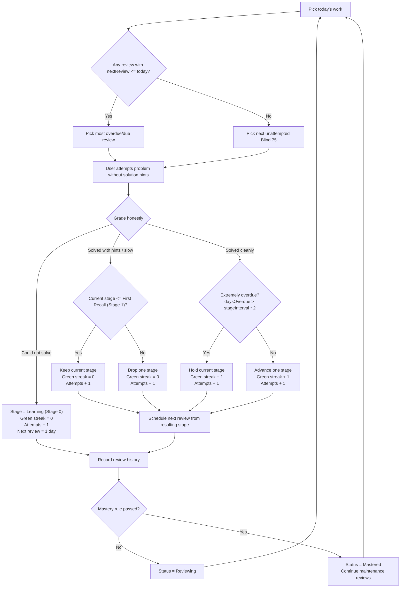

# DSA Review Algorithm

This document is the product logic source of truth for the anti-forgetting tracker.
The goal is not to mark problems complete after one solve. The goal is durable recall:
being able to recreate the solution, complexity, and core pattern after time has passed.

## Core Concepts

- **Unattempted**: The problem has not been tried in the app.
- **Learning**: The problem has been attempted but recall is not stable yet.
- **Reviewing**: The problem is in the spaced-repetition loop.
- **Mastered**: The problem has passed the mastery rule.
- **Maintenance**: A mastered problem can still return on a long review interval.

Imported CSV problems count as prior attempts, not automatic mastery.

## Review Stages

| Stage | Label | Next Review |
| --- | --- | --- |
| 0 | Learning (Stage 0) | 1 day |
| 1 | First Recall (Stage 1) | 3 days |
| 2 | Pattern (Stage 2) | 7 days |
| 3 | Transfer (Stage 3) | 14 days |
| 4 | Durable (Stage 4) | 30 days |
| 5 | Maintenance (Stage 5) | 60 days |

The app should display this table somewhere visible or easy to open.

## Review Flowchart



The important product rule is that overdue reviews do not decay automatically.
The user attempts the problem first, then the grade and lateness together decide the next stage.

## Grading Buttons

The user grades based on whether they could recreate the solution, not whether they recognized it.

Problem notes should not appear on the Today cards before grading, because notes can act
as hints and weaken the recall test. After grading, the app may prompt for a short note
about the gotcha, pattern, edge case, or complexity reminder. Saving or skipping that note
does not change stage movement or scheduling.

The edit dialog may store an optional optimal-solution reference with approach, time
complexity, space complexity, and explanation. This is study/reference material and must
not appear on Today cards before the attempt.

### Could not solve

- Stage becomes `Learning (Stage 0)`.
- Green streak resets to `0`.
- Attempts increase by `1`.
- Next review is tomorrow.

### Solved with hints / slow

- Green streak resets to `0`.
- If current stage is `Learning (Stage 0)` or `First Recall (Stage 1)`, stay at the same stage.
- Otherwise, drop one stage.
- Attempts increase by `1`.
- Next review uses the resulting stage interval.

### Solved cleanly

- Attempts increase by `1`.
- Green streak increases by `1`.
- Usually advance one stage.
- Next review uses the resulting stage interval.

## Overdue Reviews

Late reviews should not be punished automatically.

The app should show overdue copy, for example:

```text
204 days overdue
```

Then the user attempts the problem and grades honestly.

Use lateness after grading:

```text
Could not solve
  Reset to Learning (Stage 0).

Solved with hints / slow
  Drop one stage, or stay if already early-stage.

Solved cleanly
  If extremely overdue, stay at the current stage.
  Otherwise, advance one stage.
```

Define extremely overdue as:

```text
daysOverdue > currentStageInterval * 2
```

Example:

```text
Stage: Transfer (Stage 3)
Interval: 14 days
Overdue: 204 days
Grade: Solved cleanly
Result: stay at Transfer (Stage 3), schedule another 14-day review
```

This keeps the system adaptive without creating a guilt mechanic.

## Product Modes

The app has two main product modes:

- **Practice Dashboard**: the daily action surface for one due review and one new problem.
- **Diagnostics**: explanatory memory-health signals for understanding backlog pressure,
  topic risk, current stages, and recent recall quality.

Direct problem links, such as `Open on LeetCode`, are navigation aids only.
Opening a problem does not change attempts, stage, review dates, mastery, or saved state.

When a user drills into a topic from Diagnostics, the app may navigate back to the
Practice Dashboard, apply the topic filter, and scroll to the problem table. This is a
navigation aid only; it does not change scheduling or problem state.

The edit dialog may show a read-only review summary with current stage, review timing,
attempts, green streak, interval, and mastery blockers. This summary is derived from the
problem state and should not persist additional fields.

The edit dialog can separate core problem metadata from solution reference material with
tabs. Topic editing should use the app's known topic vocabulary so filters and Diagnostics
stay consistent. Tab choice and topic-list rendering are UI behavior only; they do not
change scheduling or mastery rules.

## Anti-Forgetting Insights

The Diagnostics page may show analytical memory-health signals, but these are explanatory
only. They do not change scheduling, stage movement, mastery, or daily recommendations.

The Memory Health panel should stay compact and calm. Its job is to answer:

```text
Where is forgetting pressure building?
Why might today's review have been selected?
Which topics deserve attention without turning the app into a chore board?
```

Recommended diagnostics insights:

- **Backlog Pressure**: due review count, oldest overdue review, and extremely overdue count.
- **Attention Topics**: topics with the highest diagnostic risk.
- **Current Stages**: attempted problems grouped by review stage.
- **Recent Grades**: app-graded sessions from the last 7 days, grouped into clean / slow / missed.

Attention Topics are not a failure score. They are sorted by an internal diagnostic score:

```text
recent red grade in the last 3 attempts: +4
recent yellow grade in the last 3 attempts: +2
due or overdue review: +3
extremely overdue review: +3
attempted problem still in Learning (Stage 0) or First Recall (Stage 1): +2
```

The main Diagnostics card should show attention levels instead of raw scores:

```text
High attention: score >= 40 or extremely overdue count >= 5
Medium attention: score >= 15
Low attention: score below 15
```

Raw scores may appear in a deeper "all topics" view for transparency, but they are only
used for sorting and explanation. They must not affect scheduling.

The UI should show plain-language reasons, for example:

```text
8 due · 3 early-stage · 1 recent slow
```

Recent Grades should use only app session data, not imported CSV history.
If there is little or no session data yet, the empty state should explain that recent grade
quality appears after the user grades problems in the app.

## Mastery Rule

A problem becomes `Mastered` only when all conditions are true:

```text
attempts >= difficultyThreshold
greenStreak >= 2
stage >= Durable (Stage 4)
daysSinceFirstAttempt >= 14
no "Could not solve" in the last 3 attempts
complexityKnown === true
```

Difficulty thresholds:

| Difficulty | Minimum Attempts |
| --- | --- |
| Easy | 3 |
| Medium | 4 |
| Hard | 5 |

`complexityKnown` means the user has checked:

```text
I can explain time and space complexity
```

This can be confirmed manually in the edit dialog or immediately after any successful
review grade: `Solved cleanly` or `Solved with hints / slow`. `Could not solve` should
not prompt for complexity readiness. Complexity readiness is required for mastery, but it
does not change stage movement, review scheduling, or daily recommendations.

This is intentionally lightweight. A fuller interview-readiness checklist can come later.

## Daily Recommendation Priority

The daily dashboard should prioritize:

1. Overdue reviews.
2. Reviews due today.
3. One new unattempted problem from the selected study list.

The default new-problem source is Blind 75, so the standard daily rhythm is:

```text
1 due review + 1 new problem
```

If there are many overdue reviews, Diagnostics should use calm copy:

```text
You are behind, but nothing is broken. Do reviews today and the system will adapt.
```

## Stats

Use honest progress labels:

- **Mastered**: Problems that satisfy the mastery rule.
- **Due Reviews**: Problems where `nextReview <= today`.
- **Blind 75 Attempted**: Blind 75 problems attempted at least once.
- **Blind 75 Mastered**: Blind 75 problems satisfying the mastery rule.
- **7-Day Activity**: Problems attempted or reviewed in the last 7 days. Multiple attempts on the same problem count once.

## Data Notes

Persist the minimum needed state:

```text
stage
greenStreak
completionCount
complexityKnown
firstAttemptAt
lastReviewedAt
masteredAt
nextReview
reviewHistory
```

Derive labels and intervals from the stage table instead of storing duplicate labels.
