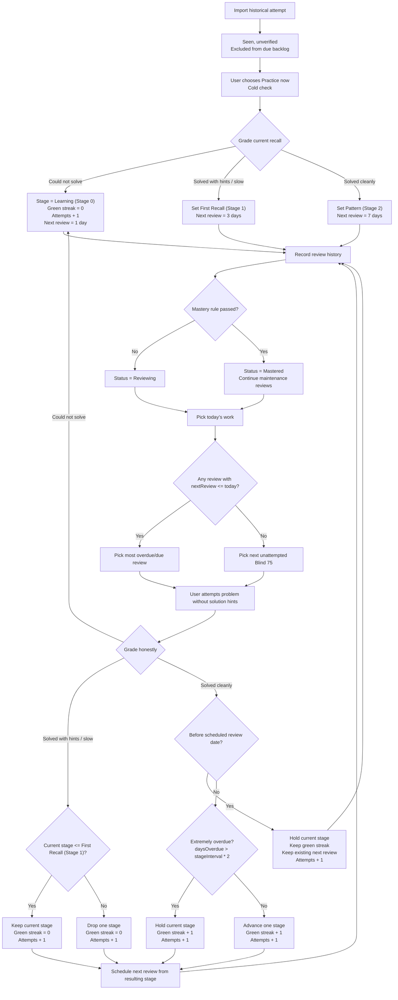

# DSA Review Algorithm

This document is the source of truth for the backward-compatible exact-title review scheduler.
When Practice V2 is enabled, [practice-v2-spec.md](practice-v2-spec.md) is the canonical source
for recommendations, evidence, and interview-readiness presentation. V2 preserves the scheduler
and all existing history, but does not treat a high stage on one memorized title as proof of
transfer to a different problem.

The goal is not to mark problems complete after one solve. The goal is durable recall plus
independent transfer: being able to recreate the solution, complexity, and underlying skill
after time has passed and on more than one title.

## Core Concepts

- **Unattempted**: The problem has not been tried in the app.
- **Learning**: The problem has been attempted but recall is not stable yet.
- **Seen, unverified**: Imported history proves prior exposure, but the user's current recall has not been graded honestly in the tracker.
- **Reviewing**: The problem is in the spaced-repetition loop.
- **Mastered**: The problem has passed the mastery rule.
- **Maintenance**: A mastered problem can still return on a long review interval.

Imported CSV and LeetCode-history problems count as prior exposure, not automatic mastery
or active review evidence.

## Review Stages

| Stage | Label | Next Review |
| --- | --- | --- |
| 0 | Learning (Stage 0) | 1 day |
| 1 | First Recall (Stage 1) | 3 days |
| 2 | Pattern (Stage 2) | 7 days |
| 3 | Transfer (Stage 3) | 14 days |
| 4 | Durable (Stage 4) | 30 days |
| 5 | Maintenance (Stage 5) | 60 days |

The app should display this table somewhere visible or easy to open.

## Exact-Title Scheduler And Legacy V0 Flowchart

The stage transitions in this flow remain the exact-title scheduler contract. The `Pick today's
work` and imported cold-check branches describe the legacy V0 surface only. Practice V2 chooses
the next task with the adaptive engine and records its richer evidence through the V2 workflow.


```mermaid
flowchart TD
  U["Import historical attempt"] --> V["Seen, unverified<br/>Excluded from due backlog"]
  V --> W["User chooses Practice now<br/>Cold check"]
  W --> X{"Grade current recall"}
  X -->|Could not solve| G
  X -->|Solved with hints / slow| X1["Set First Recall (Stage 1)<br/>Next review = 3 days"]
  X -->|Solved cleanly| X2["Set Pattern (Stage 2)<br/>Next review = 7 days"]
  X1 --> Q
  X2 --> Q

  A["Pick today’s work"] --> B{"Any review with nextReview <= today?"}
  B -->|Yes| C["Pick most overdue/due review"]
  B -->|No| D["Pick next unattempted Blind 75"]
  C --> E["User attempts problem without solution hints"]
  D --> E
  E --> F{"Grade honestly"}

  F -->|Could not solve| G["Stage = Learning (Stage 0)<br/>Green streak = 0<br/>Attempts + 1<br/>Next review = 1 day"]
  F -->|Solved with hints / slow| H{"Current stage <= First Recall (Stage 1)?"}
  H -->|Yes| I["Keep current stage<br/>Green streak = 0<br/>Attempts + 1"]
  H -->|No| J["Drop one stage<br/>Green streak = 0<br/>Attempts + 1"]

  F -->|Solved cleanly| K{"Before scheduled review date?"}
  K -->|Yes| L["Hold current stage<br/>Keep green streak<br/>Keep existing next review<br/>Attempts + 1"]
  K -->|No| M{"Extremely overdue?<br/>daysOverdue > stageInterval * 2"}
  M -->|Yes| N["Hold current stage<br/>Green streak + 1<br/>Attempts + 1"]
  M -->|No| O["Advance one stage<br/>Green streak + 1<br/>Attempts + 1"]

  I --> P["Schedule next review from resulting stage"]
  J --> P
  N --> P
  O --> P
  G --> Q["Record review history"]
  L --> Q
  P --> Q

  Q --> R{"Mastery rule passed?"}
  R -->|No| S["Status = Reviewing"]
  R -->|Yes| T["Status = Mastered<br/>Continue maintenance reviews"]

  S --> A
  T --> A
```

The important product rule is that overdue reviews do not decay automatically.
The user attempts the problem first, then the grade and lateness together decide the next stage.

## Grading Buttons

The user grades based on whether they could recreate the solution, not whether they recognized it.
The grade should reflect the full attempt: deriving the idea, coding it, checking edge
cases, and explaining complexity.
Attempt dates are date-only values based on the user's local browser calendar date, not
UTC, so late-night practice should not accidentally become tomorrow's attempt.

Default time boxes:

```text
Easy: 10-minute independent checkpoint, 20-minute full ceiling
Medium: 15-minute independent checkpoint, 30-minute full ceiling
Hard: 20-minute independent checkpoint, 45-minute full ceiling
```

At the independent checkpoint, a user with no coherent approach should record the blocker
and learn rather than continue an unproductive search. A user with a promising approach may
continue up to the full attempt ceiling. Repair and retention reps may use a shorter ceiling;
in that case the checkpoint is capped at the assigned ceiling. Neither landmark prevents the
user from opening a solution or saving an honest result.

The app may remind the user to use LeetCode's built-in stopwatch while solving. Practice V2
asks for elapsed minutes or an explicit `I did not track it` choice during reflection. Time is
speed evidence, not a solve grade: exceeding the target does not automatically turn an
independent solve into a slow/hints result and never directly alters exact-title scheduling.
The legacy V0 flow does not require elapsed time.

### Practice V2 workflow

Practice V2 replaces the visible review/new choice with one adaptive rep. QA enables this
surface automatically; local and hosted production enable it only when
`FEATURE_PRACTICE_V2=true`. The current private-beta deployment enables that flag while V0
remains the rollback path. The deterministic recommender may choose retention,
transfer, acquisition, or assessment work, but the pre-attempt UI does not reveal that internal
task type.

Before completion, the UI may show only the problem title, difficulty, locked time box, and
neutral evidence language. Topic, task type, stage, due date, list membership, saved notes,
stored solution, and private ranking rationale remain hidden so the recommendation does not hint
at the solution pattern.

The user moves through Ready, Attempting, Grading, Reflecting, Saving, and Completed states.
Selecting a grade is provisional and does not write history, activity records, stages, or review dates.
Completed appears only after persistence confirms the save. If a save fails or conflicts with newer
cloud data, the reflection remains available and the app does not present the rep as completed.
The reflection captures stopwatch evidence, assistance, blocker or friction, an optional note,
complexity readiness, and approach efficiency as applicable. The locked time box is a coaching
target, not a save gate. An independent solve may exceed it and remains independent when no
meaningful help was used; the overrun is stored separately as speed evidence. Red and yellow require
time evidence, an assistance answer, and a blocker. An independent clean result normalizes
assistance to none and clears blockers.

The Reflect grade is based primarily on two observable signals: whether working code was reached and
whether meaningful outside help was needed. Timing is a separate performance signal.
`Could not solve` means no working solution was reached or the full answer was needed. `Solved with
help or heavy friction` covers meaningful hints or help, major debugging, or substantial struggle.
`Solved independently` means working code and important tests were completed without meaningful
help. A small syntax/API mistake, edge-case correction, or modest time overrun can still be
independent when the user resolves it alone; those details are captured as friction and timing
evidence rather than rewriting the grade.
Complexity readiness is recorded separately as `Not checked`, `Partial`, or `Explained`.
`Partial` means the user understood the complexity but could not fully explain or derive it.
Only `Explained` satisfies the legacy mastery checkbox. A complexity gap can therefore block
mastery without automatically changing an otherwise independent solve to yellow.

For every working solution, approach efficiency is recorded separately as `Expected`,
`Suboptimal`, or `Unverified`. A correct independent solution remains independent evidence even
when its asymptotic time or auxiliary-space complexity is suboptimal. The suboptimal marker creates an optimization gap for the
adaptive plan instead of mislabeling the attempt as assisted. The user can put the actual
suboptimal idea in the optional attempt note; the edit dialog's Optimal Solution tab remains the
reference for the approach they want to recall later. Attempts without working code store this
field as not applicable.

After 12 recent Practice V2 graded reps without a transfer, mixed, or mock task, the
recommender prioritizes the strongest eligible transfer candidate that fits the user's current
available time. This cadence guard limits exact-title memorization. The pre-attempt UI still
hides the candidate's topic, expected pattern, and private reason code.

Back navigation preserves the draft, reload resumes an interrupted attempt, and Undo restores
only the problem and activity entry created by that rep. A stale Undo is refused when that problem
has changed, so it cannot overwrite unrelated work from another tab or device. Active drafts are
scoped to the current browser tab. If tracker state changes after a rep begins, the draft remains
visible but Save is blocked until the user returns to Ready and receives a fresh recommendation.
Only a valid Save invokes the existing grade transition and scheduler. Practice V2 changes task
selection and evidence capture, not the stage intervals, early-clean rule, extremely-overdue rule,
mastery rule, or historical data model.

Recommendation evidence has a strict temporal boundary. A graded or imported history row dated
after the user's current local date remains visible as audit history, but it does not affect
readiness, task selection, due status, or study-list progress until that date arrives. An explicit
attempt timestamp later than the current clock is treated the same way. Future timestamps cannot
start an exact-title cooldown or replace the latest valid attempt. When a future row has also
written a future review date into derived problem state, the recommender prefers the latest valid
history row's saved review date and otherwise treats the derived date as untrusted. Without future
evidence, the problem's current `nextReview` remains authoritative; an older history row cannot
silently override a legitimate schedule edit or recalculation.

Practice V2 displays `Could not solve`, `Solved with help or heavy friction`, and
`Solved independently`. They map to the stored red, yellow, and green grades used by the
exact-title scheduler. Legacy V0 and manual backfill may still display the older
`Solved with hints / slow` and `Solved cleanly` labels for the same stored values.

Use red when the user needed the solution or could not reach working code. Use yellow when the
user needed meaningful help or got there with major debugging or substantial struggle. Use green
when the user produced working code and tested important cases without meaningful help. An
elapsed time above the target is stored honestly as a speed gap and does not automatically change
the grade. Approach efficiency and complexity readiness remain separate signals.

The grade answers how independently the user completed the attempt. Learning-signal tags
answer why the attempt was difficult. For example, wrong syntax, a language mistake, or a
buggy loop implementation should use the `syntax / implementation bug` tag; the grade
still depends on whether the user solved independently, needed hints, or could not solve.

Problem notes should not appear on the Today cards before grading, because notes can act
as hints and weaken the recall test. After grading, the app may prompt for a short note
about the gotcha, pattern, edge case, or complexity reminder. Saving or skipping that note
does not change stage movement or scheduling.

The post-grade prompt may also offer optional learning-signal tags:

- wrong pattern
- missed invariant
- edge case
- syntax / implementation bug
- needed hint
- too slow

These tags are stored on the specific review-history entry. They explain what made a rep
hard and can appear in the History tab or future Memory views. They do not affect stage
movement, mastery, scheduling, leaderboard metrics, or reminder behavior.

After any real grade, the Practice tab may show a calm completion cue such as
`Today complete. Momentum protected.` plus grade-specific feedback. This message is
motivational only. The scheduling result, next review date, and any hold reason remain the
actual algorithm output.

The post-grade prompt may also include an `Undo grade` action. Undo is a safety control for
the most recent accidental grade. It removes that attempt's matching history and internal
activity record, then rebuilds derived state without overwriting unrelated work.

The edit dialog may store an optional optimal-solution reference with approach, time
complexity, space complexity, and explanation. This is study/reference material and must
not appear on Today cards before the attempt.

The edit dialog may also expose a History tab for manual backfill. Backfill is for attempts
completed outside the app. Manual backfill accepts only real grades: `Could not solve`,
`Solved with hints / slow`, or `Solved cleanly`. It should not create new `imported`
entries.

When backfilled grades are saved, replay proper graded history in chronological order and
let the most recent graded attempt define the current stage, green streak, last review
date, last grade, and next review date. Compute the next review from the backfilled attempt
date, not from today's date. If that next review date is already
in the past, the problem is simply overdue.

When multiple real attempts share a calendar date, use their recorded occurrence timestamps
to replay them in the order they happened. The manual backfill form allows one real grade per
problem per calendar date because a date-only backfill cannot truthfully establish within-day
order. Users must delete the existing row before replacing that day's grade. Legacy
date-only duplicates use a stable deterministic fallback, so source-array order cannot change
the resulting evidence, stage, or recommendation.

Imported CSV rows remain historical context and can count as prior attempts, but only
proper grades should drive manual backfill scheduling. Manual backfills entered with a
real grade are also recorded as app sessions on the attempt date, so same-week backfills
can appear in Recent Grades and leaderboard weekly activity. Imported CSV rows do not
create sessions.

LeetCode imports from the optional Chrome extension follow the same historical context
rule. The extension prefers LeetCode's signed-in submissions API and can fall back to the
rendered progress page. Captured Accepted, Wrong Answer, or other result rows are stored
as `imported` history only. Accepted is not automatically `Solved cleanly`, failed
submissions are not automatically missed solves, and imported LeetCode rows do not count
for Minimum Practice, Friend Pulse, leaderboard weekly stats, mastery green streak, or
Recent Grades.
Import review may label rows with a provisional starting stage so users can organize the
import, and users may remove rows before applying it. Once imported, a problem with no
real grade is displayed as `Seen, unverified`, has no trusted next-review date, and is
excluded from due-review recommendations, backlog pressure, and stage distribution.
Provisional import stages are not real grades and do not create green streak, mastery,
session, pact, or leaderboard credit.

### Legacy V0 cold checks for imported history

This subsection applies when Practice V2 is disabled. With Practice V2 enabled, imported-only
problems are labeled `Assessment pending`; the adaptive engine decides when one is the strongest
next rep, and the standard V2 reflection captures the resulting evidence. Imported history is
untrusted exposure in both modes.

The Library exposes `Practice now` for a `Seen, unverified` problem. This starts a cold
check in Practice. The user attempts the problem without consulting saved notes or a
solution, uses LeetCode's stopwatch, and gives one honest grade. The first real grade sets
the trusted baseline directly:

| Cold grade | Trusted stage | Next review |
| --- | --- | --- |
| Could not solve | Learning (Stage 0) | 1 day |
| Solved with hints / slow | First Recall (Stage 1) | 3 days |
| Solved cleanly | Pattern (Stage 2) | 7 days |

Stale imported review dates do not trigger early-clean or extremely-overdue holds during
this first calibration. After the cold check, every future grade uses the normal review
algorithm. The cold check records duration, code result, assistance level, primary
blocker, and a recall score from 0-4 on the history entry. These fields explain the
benchmark; the selected grade is what determines the baseline stage.

The user runs LeetCode's stopwatch during the attempt. Selecting a cold grade is
provisional: it opens the cold-check record but does not create history, activity, stage
movement, or a next-review date. The grade can still be revised there. The app saves the
grade, stopwatch minutes, code result, assistance, blocker, recall score, baseline stage,
and next review together only when the user chooses `Finish cold check`. Notes and
learning-signal tags remain optional.

The selected problem, active attempt, and unfinished cold-check form live in browser
session storage so navigation or a reload can resume the workflow without changing
tracker data. `Back to attempt` discards the provisional grade while keeping the problem
selected. Undoing a completed cold check removes its real grade and schedule and returns
the problem to the selected `Seen, unverified` state. Switching to another active problem
requires confirmation so the neighboring Review card cannot be graded silently while a
cold attempt is active.
The pre-attempt card shows the applicable time box: Easy 20 minutes, Medium 30 minutes,
or Hard 45 minutes. The tracker does not run a second timer; it asks for LeetCode's final
stopwatch minutes after grading.

A manual graded backfill on an imported-only problem may establish a backfilled baseline,
but it is not labeled as a timed cold check and does not require stopwatch evidence.

Clean solves only prove spaced recall when they happen on or after the scheduled review
date. A clean solve before the scheduled review date is still recorded as history, but it
holds the current stage, keeps the existing next review date, and does not increase the
mastery green streak. Early weakness still matters: `Could not solve` and
`Solved with hints / slow` reschedule from the attempt date.

### Could not solve

- Stage becomes `Learning (Stage 0)`.
- Green streak resets to `0`.
- Attempts increase by `1`.
- Next review is `1 day` after the attempt date.

### Solved with hints / slow

- Green streak resets to `0`.
- If current stage is `Learning (Stage 0)` or `First Recall (Stage 1)`, stay at the same stage.
- Otherwise, drop one stage.
- Attempts increase by `1`.
- Next review uses the resulting stage interval.

### Solved cleanly

- Attempts increase by `1`.
- If the attempt is before the scheduled review date, hold the current stage, keep the existing next review date, and do not increase green streak.
- If the attempt is on or after the scheduled review date, green streak increases by `1`.
- Usually advance one stage when the attempt is on time or overdue.
- Next review uses the resulting stage interval unless the clean solve was early.

## Overdue Reviews

Late reviews should not be punished automatically.

The app should show overdue copy, for example:

```text
204 days overdue
```

Then the user attempts the problem and grades honestly.

Use lateness after grading:

```text
Could not solve
  Reset to Learning (Stage 0).

Solved with hints / slow
  Drop one stage, or stay if already early-stage.

Solved cleanly
  If extremely overdue, stay at the current stage.
  Otherwise, advance one stage.
```

Define extremely overdue as:

```text
daysOverdue > currentStageInterval * 2
```

Example:

```text
Stage: Transfer (Stage 3)
Interval: 14 days
Overdue: 204 days
Grade: Solved cleanly
Result: stay at Transfer (Stage 3), schedule another 14-day review
```

This keeps the system adaptive without creating a guilt mechanic.

## Product Modes

The app has several product surfaces:

- **Practice**: one adaptive rep when Practice V2 is enabled; the legacy V0 fallback shows one
  due review plus one new problem.
- **Library**: browsing, filtering, sorting, editing, and manual backfill.
- **Memory**: explanatory memory-health signals for understanding backlog pressure,
  topic risk, current stages, and recent recall quality.
- **Settings**: imports, exports, list seeding, environment tools, and optional
  feature-flagged experiments such as reminders.

Direct problem links, such as `Open on LeetCode`, are navigation aids only.
Opening a problem does not change attempts, stage, review dates, mastery, or saved state.

When a user drills into a topic from Memory, the app may navigate to Library, apply the
topic filter, and scroll to the problem table. This is a
navigation aid only; it does not change scheduling or problem state.

In the legacy UI, the edit dialog may show current stage, review timing, attempts, green
streak, interval, and mastery blockers. In Practice V2 it instead shows current evidence,
last honest check, latest result, help or friction, recorded time, and the secondary
exact-title recall date. Both summaries are derived from existing state and persist no
additional fields.

The edit dialog can separate core problem metadata from solution reference material with
tabs. Topic editing should use the app's known topic vocabulary so filters and Memory
stay consistent. Tab choice and topic-list rendering are UI behavior only; they do not
change scheduling or mastery rules.

## Anti-Forgetting Insights

The Memory page may show analytical memory-health signals, but these are explanatory
only. They do not change scheduling, stage movement, mastery, or daily recommendations.

The Memory Health panel should stay compact and calm. Its job is to answer:

```text
Where is forgetting pressure building?
Why might today's review have been selected?
Which topics deserve attention without turning the app into a chore board?
```

Recommended diagnostics insights:

- **Backlog Pressure**: due review count, oldest overdue review, and extremely overdue count.
- **Attention Topics**: topics with the highest diagnostic risk.
- **Current Stages**: attempted problems grouped by review stage.
- **Recent Grades**: app-graded sessions from the last 7 days, grouped into clean / slow / missed.

Attention Topics are not a failure score. They are sorted by an internal diagnostic score:

```text
recent red grade in the last 3 attempts: +4
recent yellow grade in the last 3 attempts: +2
due or overdue review: +3
extremely overdue review: +3
attempted problem still in Learning (Stage 0) or First Recall (Stage 1): +2
```

The main Memory card should show attention levels instead of raw scores:

```text
High attention: score >= 40 or extremely overdue count >= 5
Medium attention: score >= 15
Low attention: score below 15
```

Raw scores may appear in a deeper "all topics" view for transparency, but they are only
used for sorting and explanation. They must not affect scheduling.

The UI should show plain-language reasons, for example:

```text
8 due · 3 early-stage · 1 recent slow
```

Recent Grades should use only app session data, including manual graded backfills, not
imported CSV history.
If there is little or no session data yet, the empty state should explain that recent grade
quality appears after the user grades problems in the app.

## Habit Signals

The Practice tab may show a lightweight Minimum Viable Practice panel. This is a
habit-building aid only; it does not change scheduling, stage movement, mastery,
leaderboard privacy, cloud sync, or saved schema.

A Minimum Viable Practice day is complete when the user records any real graded attempt:

```text
Could not solve
Solved with hints / slow
Solved cleanly
```

Valid sources are Today-card grades and manual graded backfills. Imported CSV rows do not
complete a habit day because they are historical context, not current practice.

The panel may show:

- **Today**: complete if a real grade exists for the user's local date.
- **This Week**: distinct practice days in the current Monday-Sunday week, with a soft
  rhythm target of `4`.
- **Rhythm**: consecutive practice days, anchored on today when complete or yesterday
  when today is still open.

Copy should stay gentle and non-punitive:

```text
One real grade is enough to keep the loop alive.
Minimum day complete. Momentum protected.
Comeback day logged. The loop is alive again.
```

In hosted mode, Settings may offer an optional phone reminder for Minimum Practice when
`FEATURE_PHONE_REMINDERS=true` and server push keys are configured. The reminder is
explanatory and motivational only. It does not affect stage movement, mastery, review
scheduling, leaderboard metrics, or cloud sync. If enabled, it checks the user's selected
local reminder time and sends only when no real graded attempt has been recorded for that
local date.

## Friend Pulse

Hosted mode may include opt-in daily pacts when `FEATURE_FRIEND_PULSE=true`. Friend Pulse
is social motivation only; it does not affect scheduling, stage movement, mastery,
leaderboard calculations, reminders, or saved tracker state shape.

Friend Pulse completion uses the same Minimum Practice signal: any real graded attempt on
the user's profile-local date completes the day. Today-card grades and manual graded
backfills count. Imported CSV history, ungraded notes, and future-dated backfills do not
count.

Privacy rules:

- Users must choose a display name and letters-only `@handle` before enabling daily pacts.
- Exact-handle search returns only users who enabled daily pacts.
- Pact friends can see only display name, handle, and whether Minimum Practice is open or
  complete today.
- Problem names, grades, notes, timestamps, emails, and raw history must not be exposed in
  Friend Pulse responses.
- If either user disables daily pacts, active pact records remain stored but are paused in
  the UI until both users opt back in.
- Pending outgoing pact requests can be retracted.
- Removing, declining, or retracting a pact does not permanently block either person. A
  later exact handle search can start a fresh pending request.

## Mastery Rule

A problem becomes `Mastered` only when all conditions are true:

```text
attempts >= difficultyThreshold
greenStreak >= 2
stage >= Durable (Stage 4)
daysSinceFirstAttempt >= 14
no "Could not solve" in the last 3 attempts
complexityKnown === true
```

Difficulty thresholds:

| Difficulty | Minimum Attempts |
| --- | --- |
| Easy | 3 |
| Medium | 4 |
| Hard | 5 |

`complexityKnown` means the user selected:

```text
Explained: I can confidently explain time and space complexity
```

Practice V2 also records `Not checked` and `Partial` without treating either as mastery-ready.
Complexity readiness is required for mastery, but it does not change the solve grade, stage
movement, or exact-title review scheduling.

This is intentionally lightweight. A fuller interview-readiness checklist can come later.

## Legacy V0 Daily Recommendation Priority

This section applies only when Practice V2 is disabled. Practice V2 uses the adaptive
recommendation rules in [practice-v2-spec.md](practice-v2-spec.md) and does not expose a fixed
review-plus-new queue.

The daily dashboard should prioritize:

1. Due Recovery Lane reviews, only when `FEATURE_RECOVERY_LANE=true`.
2. Other overdue reviews.
3. Other reviews due today.
4. One new unattempted problem from the selected study list.

Imported-only `Seen, unverified` problems are not due reviews and do not enter this queue
automatically. The user can deliberately launch one from Library as a cold check; while
selected, it temporarily occupies the new/cold-check card without changing the review pick.

When Recovery Lane is disabled, old `recoveryLane` state may remain in saved data but it
must not affect recommendation priority or the Practice UI.

The default new-problem source is Blind 75, so the standard daily rhythm is:

```text
1 due review + 1 new problem
```

If a selected study-list pick matches an existing imported CSV row by title or LeetCode
URL, grading that pick may attach the selected list membership to the existing row instead
of creating a duplicate problem.

If there are many overdue reviews, Memory should use calm copy:

```text
You are behind, but nothing is broken. Do reviews today and the system will adapt.
```

Memory backlog counts may be hidden behind a reveal control by default. This is a
pressure-reduction UI choice only: the review queue, due-review priority, and scheduling
rules are unchanged. The visible copy should keep the focus on one review at a time.

## Recovery Lane

When `FEATURE_RECOVERY_LANE=true`, the Practice tab may show a Recovery Lane for up to `3`
manually chosen problems. This is a tiny active focus list for cold or important reviews
the user wants to bring back online. It is not a separate schedule.

Rules:

- Users manually add and remove problems.
- Recovery Lane problems are prioritized only when they are already due.
- Not-due Recovery Lane problems stay visible, but they should not be forced early.
- The normal review schedule, stage movement, and mastery rules remain unchanged.
- When a Recovery Lane problem reaches `Transfer (Stage 3)`, it graduates and leaves the lane.

Recommended copy:

```text
Bring these back online. The rest can wait.
All that matters is the next one.
Problem graduated from Recovery Lane.
```

## Stats

Use honest progress labels:

- **Mastered**: Problems that satisfy the mastery rule.
- **Due Reviews**: Problems where `nextReview <= today`.
- **Blind 75 Attempted**: Blind 75 problems attempted at least once.
- **Blind 75 Mastered**: Blind 75 problems satisfying the mastery rule.
- **7-Day Activity**: Problems attempted or reviewed in the last 7 days. Multiple attempts on the same problem count once.

## Data Notes

## Recommendation V2 Policy Layer

The tracker can run a reversible `readiness-v2.0` recommendation policy over the existing v4
state. It does not rewrite stages, review dates, history, imports, or grades. The legacy
`readiness-v1.9` policy remains available as the rollback path.

The V2 decision order is:

1. Repair a recent red, yellow, or explicitly recorded optimization-friction result.
2. Prefer an unseen title in a skill with independent evidence so the user tests transfer
   rather than retyping a familiar answer.
3. Treat imported-only history as unverified current work and recommend it as learnable work.
4. Use exact-title retention only when the scheduled review is due after a meaningful gap, or
   as a delayed retention check after a longer gap.

Recent ordinary green titles are therefore not routine daily repeats. Exact-title repairs remain
available when a recent weakness needs attention. A Hard transfer candidate requires independent
green Medium evidence from at least two distinct titles sharing its pattern metadata. If the
catalog does not have a usable pattern identifier, it is treated as unknown rather than claiming
that a broad topic proves a specific pattern.

The policy fits the selected time budget, including reflection overhead. A short budget can
legitimately produce no eligible new candidate; the UI reports that clearly instead of silently
overrunning the user's stated capacity. Future-dated attempts are excluded from evidence,
cooldowns, and due-date decisions.

Recommendation V2 is explanatory and selection-only. The scheduler transition rules still own
stage movement and `nextReview`, and all recommendation reasons remain private until after the
independent attempt when revealing them could leak the approach.

State-changing actions are persistence-acknowledged. Grading, Undo, problem edits,
history edits, notes, list seeding, and imports should show success only after the
server or local state file confirms the save. Saves are serialized so rapid actions
cannot reuse a stale cloud revision. If a save fails or returns a stale-revision
conflict, restore the affected in-memory state and keep the user's editable input
available where possible. Multi-row imports are one atomic save rather than a series
of partially committed rows.

When an idle hosted tab regains focus, it may refresh newer cloud state. It must not
refresh while a local save is queued or in flight, and it must never replace an active
Practice V2 attempt. An active attempt whose starting state revision is stale remains
visible for recovery, but cannot be saved as fresh evidence.

Persist the minimum needed state:

```text
stage
greenStreak
completionCount
complexityKnown
firstAttemptAt
lastReviewedAt
masteredAt
nextReview
reviewHistory
```

Derive labels and intervals from the stage table instead of storing duplicate labels.

Problem identity should use a canonical LeetCode slug when possible. Prefer the slug from
the LeetCode URL, normalize known aliases such as `generate-parenthesis` to
`generate-parentheses`, and compare canonical slugs during imports, study-list seeding,
and new-pick grading. This prevents duplicate rows when a CSV title or older URL uses a
slightly different slug than the built-in study-list data.
